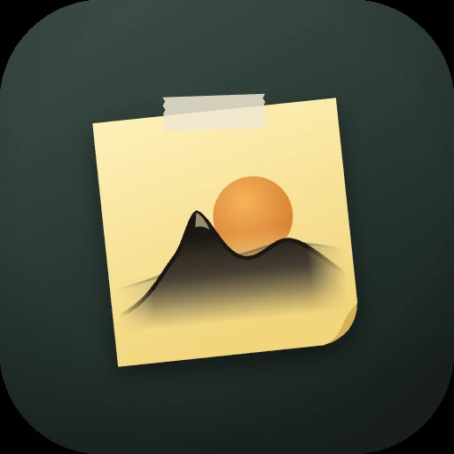

# 日迹

每天一页的个人笔记：记灵感、做 TODO、推进长期进度、晚上写一句总结。
内容默认端到端加密，只有你点头的数字和日志才出现在个人网站上。
笔记能力向下兼容 macOS「备忘录」，外观是「纸与墨」。

- 设计文档：[docs/DESIGN.md](docs/DESIGN.md)
- 视觉原型：[design/prototype.html](design/prototype.html)（方向 A · 纸与墨）
- 同步规格与跨平台测试向量：[spec/](spec/)
- 图标「便利贴日出」：[design/icon/](design/icon/)（`icon.py` 生成全部图层，`png.mjs` 渲染 Android 与网页用的 PNG）
- 宣传页：[site/](site/)（单个 `index.html`，无外部依赖）

## 现状（2026-10-08）

| 部分 | 状态 |
| --- | --- |
| 同步协议 v1（规范 JSON、HLC、HKDF、AES-256-GCM 日志段、合并） | 参考实现 + Swift + Kotlin，三份实现通过同一组测试向量，逐字节一致 |
| macOS 应用 | 今天页、今日目标跨天延续、明日目标自动成为次日今日目标、Spark 便利贴、长期进度、随记、今日总结、时间线、热力图、只提醒缺项的晚间提醒（⌘, 设时间）与早上补写；数据在本机 |
| iOS / iPadOS | 与 macOS 共用代码，能编译；以 macOS 为准，适配以后做 |
| Android 应用 | 同样的功能（Compose），在 API 35 模拟器上实测；数据在本机 |
| 邮件提醒（兜底） | 腾讯云 `server/reminder/`：通知之后仍没写才发信，可多个收件邮箱；设备只上报今天的几个数字 |
| 一键同步、网站连接、备忘录导入 | 下一阶段（P2 / P3，见设计文档 §12） |

## 运行

**macOS**（需要 Xcode 26+ 与 [XcodeGen](https://github.com/yonaskolb/XcodeGen)）

```bash
cd apple/Riji && xcodegen generate && open Riji.xcodeproj   # 选 RijiMac，⌘R
```

快捷键：`⌘T` 回到今天，`⌘1` 时间线，`⌘2` 进度，`⌘,` 晚间提醒设置。

**Android**（JDK 17、Android SDK 35）

```bash
cd android && ./gradlew :app:installDebug
```

也可以在 GitHub Actions 的 `android` 运行结果里下载 `riji-debug-apk`，直接装到手机上。
荣耀手机请在「设置 → 应用 → 日迹」里允许自启动与后台运行，否则晚间提醒可能被系统拦下。

## 测试

```bash
node spec/reference/verify-vectors.mjs        # 规格向量
cd apple/RijiKit && swift test                # Swift：向量 + 每日规则 + 性能
cd android && ./gradlew :core:test            # Kotlin：向量 + 每日规则 + 性能
python3 -m unittest server/reminder/test_reminder.py   # 邮件提醒服务（不发真邮件）
```

CI（`.github/workflows/`）在每次推送时跑以上全部，并编译 macOS、iOS 与 Android 调试包。

## 平台

Android（Kotlin + Compose）与 macOS（Swift）先行；iOS、iPad、Windows 以后。
